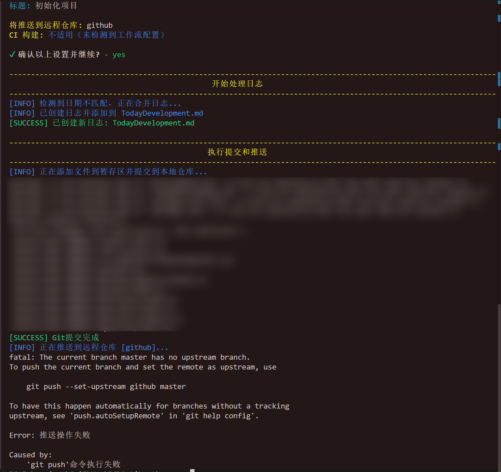

# OGit

一个用 Rust 编写的增强型 Git 操作工具，可以帮助你轻松提交代码到 Git 仓库、自动记录开发日志，并提供其他实用的 Git 操作功能。

## 功能

- 提交代码到 Git 仓库
- 自动记录每日开发日志
- 支持 CI 构建控制（可选添加[skip ci]标记）
- 智能处理日志文件日期变更
- 命令行交互式操作
- 支持多行提交标注（标题+正文列表）
- 日志文件完全符合 Markdown 格式标准
- 支持编辑提交标注（可在确认前修改已输入的内容）
- 优雅的命令行界面，带有彩色输出和自适应分隔线

## 安装

### 方法一：使用预编译可执行文件（Windows）

本项目根目录提供了预编译的 Windows 可执行文件`og.exe`，适合没有安装 Rust 环境或不想编译的用户：

1. 下载本仓库，或者只下载`og.exe`文件
2. 将`og.exe`放置在任意位置，并将该位置添加到系统环境变量PATH中

这种方式无需安装 Rust 环境，并且添加到环境变量后可以在任意位置使用`og`命令。

### 方法二：从源码编译

确保你已安装 Rust 环境，然后克隆此仓库并编译：

```bash
git clone https://github.com/iisyw/OGit.git
cd og
cargo build --release
```

编译后的可执行文件在`target/release`目录中。你可以将该目录添加到环境变量PATH中，或者将`og.exe`复制到已在PATH中的目录。

### 方法三：使用 Cargo 安装

如果你已经安装了 Rust 和 Cargo，可以直接使用以下命令安装：

```bash
cargo install --git https://github.com/iisyw/OGit.git
```

这将自动下载、编译并安装 OGit 到你的系统中（通常在`~/.cargo/bin`目录下），该目录通常已添加到环境变量PATH中。

## 添加到环境变量PATH（Windows）

将OGit添加到环境变量，可以在任何位置使用`og`命令：

1. 右键点击"此电脑"或"我的电脑"，选择"属性"
2. 点击"高级系统设置"
3. 点击"环境变量"
4. 在"系统变量"或"用户变量"部分找到"Path"变量并选择"编辑"
5. 点击"新建"，添加og.exe所在的完整路径
6. 点击"确定"保存更改

重新打开命令提示符或PowerShell后，你就可以在任何位置使用`og`命令了。

## 使用前提条件

在使用 OGit 之前，请确保您的项目已满足以下条件：

1. **Git 仓库已初始化**：项目目录必须是一个有效的 Git 仓库（已执行过`git init`）
2. **已配置远程仓库**：如果需要推送功能，必须已设置远程仓库（如`git remote add origin 仓库URL`）

这些条件非常重要，因为：

- 如果没有设置远程仓库，推送操作会失败
- 首次推送时可能需要设置上游分支关系

虽然建议首次使用前先手动完成一次 Git 提交，但即使是全新仓库也可以使用 OGit。如果遇到问题，只需按照下方的解决方案操作即可。

### 首次推送常见问题解决

如果您是首次使用 OGit 推送到远程仓库，可能会遇到以下错误：



```sh
fatal: The current branch master has no upstream branch.
To push the current branch and set the remote as upstream, use

    git push --set-upstream origin master

To have this happen automatically for branches without a tracking
upstream, see 'push.autoSetupRemote' in 'git help config'.

Error: 推送操作失败
```

**解决方法**：

1. 按照提示执行命令设置上游分支：

   ```bash
   git push --set-upstream origin master
   ```

   （如果您使用的是 main 分支，将 master 替换为 main）

2. 或者，配置 Git 自动设置上游分支：

   ```bash
   git config --global push.autoSetupRemote true
   ```

执行上述命令后，再次使用 OGit 工具即可正常推送。这个错误只会在首次推送分支时出现，设置好跟踪关系后将不会再次遇到。

## 使用方法

### 基本用法

```bash
og
```

这将启动完全交互式提示，依次询问：

- 提交标题和正文内容
  - 首先输入标题（如果不输入标题，将使用默认值"Normal Update"）
  - 然后逐行输入正文内容（每行将自动添加`-`前缀）
  - 输入空行结束正文输入
- 提供提交标注预览并允许编辑已输入的内容
  - 可以修改标题
  - 可以修改任意正文行
  - 可以添加新的正文行或删除已有行
- 是否需要推送到远程仓库
- 远程仓库名称
- 是否需要进行 CI 构建

即使您选择使用默认标题"Normal Update"（不输入标题直接回车），仍然可以继续输入正文内容。这使得创建格式规范的提交信息变得更加灵活。

您也可以直接在命令行指定提交标注：

```bash
og "提交消息"
```

当提供命令行参数时，该参数将作为提交标题，并且程序仍然会提示您输入正文内容。这样可以快速设置标题的同时，还能灵活地添加详细的正文说明。

### 多行提交标注格式

程序支持创建如下格式的提交标注：

```md
标题内容

- 正文第一行内容
- 正文第二行内容
- 正文第三行内容
```

在交互模式下，你只需要输入每行的实际内容，工具会自动添加`-`前缀和必要的换行。

### 编辑提交标注

在输入完成提交标注后，程序会显示预览并询问是否需要编辑。如果选择编辑，将显示一个菜单：

```md
当前提交标注内容:
标题: 修复登录和验证功能
正文:

- 修复登录接口错误
- 优化验证流程

请选择要编辑的部分: 0. 返回不修改

1. 编辑标题
2. 编辑正文第 1 行
3. 编辑正文第 2 行
4. 添加新的正文行
5. 删除最后一行正文
```

通过输入对应的数字，你可以：

- 修改标题
- 修改任意一行正文
- 添加新的正文行
- 删除最后一行正文

这样就可以在提交前完善你的提交标注，无需重新运行整个流程。

### 命令行选项

```bash
# 提交并推送到默认远程仓库(origin)
og "提交消息" -p

# 提交并推送到指定远程仓库
og "提交消息" -p -r origin

# 启用CI构建
og "提交消息" -p -c

# 禁用CI构建(添加[skip ci]标记)
og "提交消息" -p -n
# 或者使用别名
og "提交消息" -p --nc
```

无论是否在命令行中提供提交消息，程序都会进入完整的交互式流程，允许您输入详细的正文内容。命令行参数只是提供了一个初始的标题值。

### 命令行参数

- `提交消息`: 提交的说明文字，将作为默认标题
- `-p, --push`: 是否推送到远程仓库
- `-r, --remote <REMOTE>`: 远程仓库名称，默认为"origin"
- `-c, --ci`: 启用 CI 构建
- `-n, --no-ci, --nc`: 禁用 CI 构建，添加[skip ci]标记

## 日志文件

该工具会创建和维护两个 Markdown 格式的日志文件：

- `TodayDevelopment.md`: 记录当天的开发日志
- `Development.md`: 长期开发日志，当日期变更时会自动合并今日日志

日志格式完全符合 Markdown 标准，支持多行提交信息的正确格式化：

```markdown
## 2024/05/10

1. 修改登录和验证多因素认证接口，优化缓存管理
   - 修改登录接口，增加菜单列表缓存
   - 修改验证多因素认证接口，增加菜单列表缓存
   - 去除刷新访问令牌接口的权限标识缓存
2. 修复其他功能问题
```

这种格式可以直接在支持 Markdown 的查看器中正确显示，保持列表的层级结构。

## 依赖项

本项目使用以下主要依赖：

- `clap`: 用于命令行参数解析
- `chrono`: 用于日期和时间处理
- `git2`: 用于 Git 操作
- `anyhow`: 用于错误处理
- `dialoguer`: 用于交互式命令行对话
- `colored`: 用于彩色输出
- `rustyline`: 用于改进的命令行输入体验

## 许可证

本项目采用 MIT 许可证。详情请参阅 [LICENSE](LICENSE) 文件。

MIT 许可证是一个宽松的软件许可证，它基本上允许任何人以任何方式使用您的代码，前提是他们在自己的项目中保留许可证声明和版权声明。这意味着：

- 可以自由使用、复制、修改、合并、发布、分发、再许可和/或出售本软件的副本
- 必须在所有副本或重要部分中包含上述版权声明和本许可声明
- 软件按"原样"提供，没有任何形式的明示或暗示的保证
